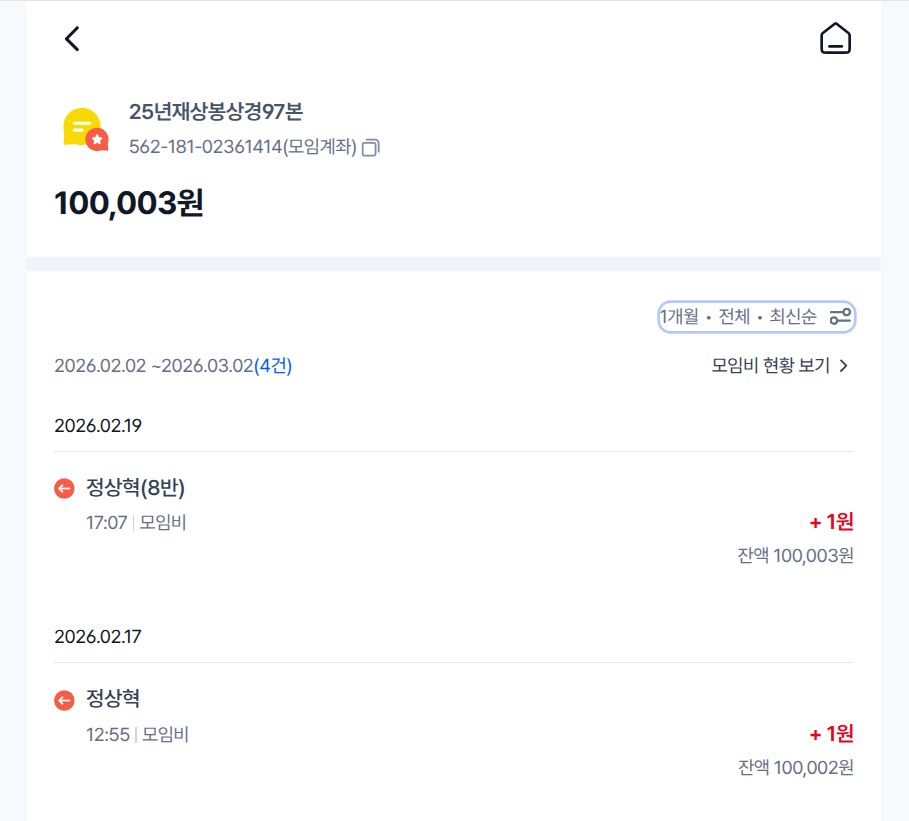
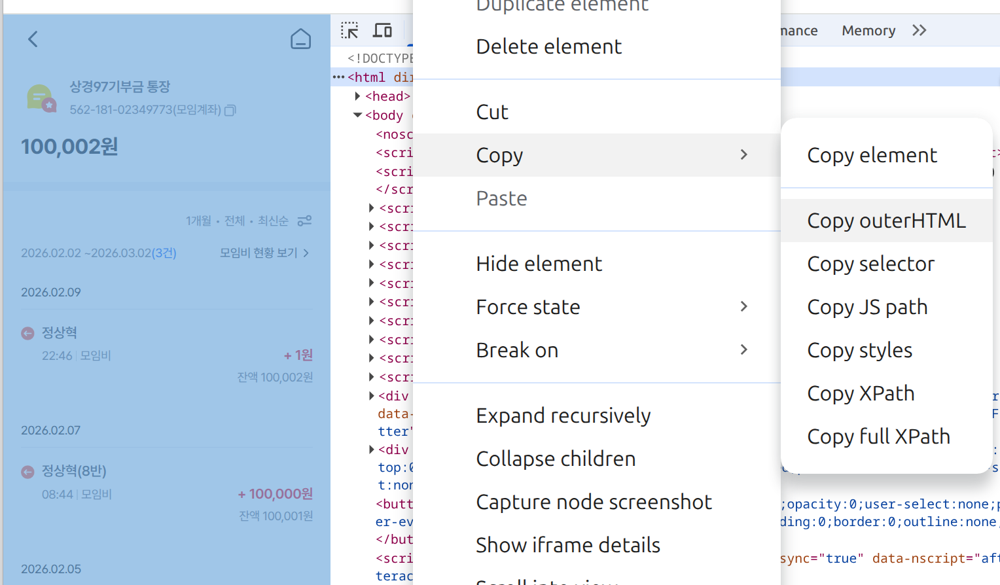
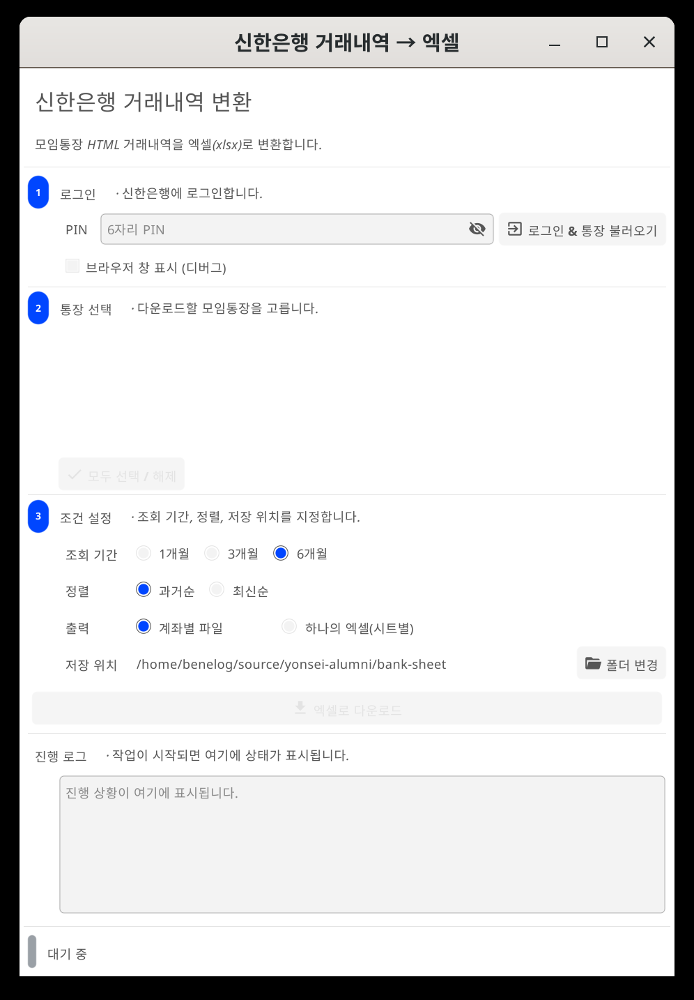

# 통장 거래내역 변환기
신한은행 모임통장에서는 계좌를 개설한 모임장만이 입금내역을 홈페이지에서 엑셀로 다운로드를 받을 수 있습니다.
이 프로그램은 모임장이 아닌 사람도 입금내역을 단순반복 작업없이 Excel로 변환할 수 있도록 도와줍니다.

## 사용법

### HTML 파일 저장
PC에서 신한은행 모바일 페이지로 접근하여 HTML 파일을 저장합니다. (PC 홈페이지에서는 모임원에게는 모임통장 조회 기능이 제공되지 않습니다.)

1. 크롬 브라우저로 https://m.shinhan.com/mw/pg/SP0102S0200F01?mid=270040220100&groupId=493705 으로 접속합니다.
    * 인증은 '신한 인증서'를 클릭하시면 신한은행 모바일앱의 'SOL 패스 인증'등을 통해 하실 수 있습니다.
2. 통장 목록 -> 통장 홈으로 이동합니다.
3. '입출금 ?원'을 클릭하여 입출금내역 페이지로 이동합니다. (조회조건을 설정할 수 있는 페이지입니다.)
4. 원하는 내역이 나오도록 조회 조건을 지정하여 재조회합니다.
5. 크롬의 DevTools 메뉴로 들어갑니다. (단축키 F12)
6. Elements 탭에서 최상단 `<html>` 노드 클릭 → 우클릭 Copy → Copy outerHTML 을 선택합니다.
7. 복사된 내용을 메모장 같은데 붙여넣고 인식이 쉬운 파일명으로, 확장자는 .html으로 저장합니다.

<거래 내역 페이지>

<DevTool 메뉴에서 HTML 복사>

### 프로그램 다운로드

[Releases](https://github.com/yonsei-alumi/bank-sheet/releases/latest) 페이지에서 운영체제에 맞는 파일을 받으세요.

| 파일 | 운영체제 |
|------|----------|
| `bank-sheet-linux-amd64` | Linux (x86_64) |
| `bank-sheet-windows-amd64.exe` | Windows (x86_64) |

### 엑셀 변환

1. 다운로드한 프로그램을 실행합니다.
2. "HTML 파일 선택" 버튼을 클릭하여 저장한 HTML 파일을 선택합니다.
3. 거래 내역이 분석되고, 같은 디렉터리에 동일한 이름의 엑셀 파일(.xlsx)이 자동 생성됩니다.
4. 생성 완료 후 "생성된 파일을 열까요?" 대화상자에서 Yes를 누르면 바로 열 수 있습니다.

#### 엑셀 파일 형식

| 열 | 내용 | 형식 |
|----|------|------|
| 입금일자 | 거래 일시 | YYYY-MM-DD HH:mm:ss |
| 입금자 | 입금한 사람 이름 | 문자 |
| 입금액 | 입금 금액 | 숫자 (천 단위 콤마) |
| 잔액 | 거래 후 잔액 | 숫자 (천 단위 콤마) |

### 후속 작업

### 참고자료
* [그 밖의 다른 방법](ALTERNATIVE.md)
* [이 프로그램의 기술적인 명세](TECH_NOTE.md)
