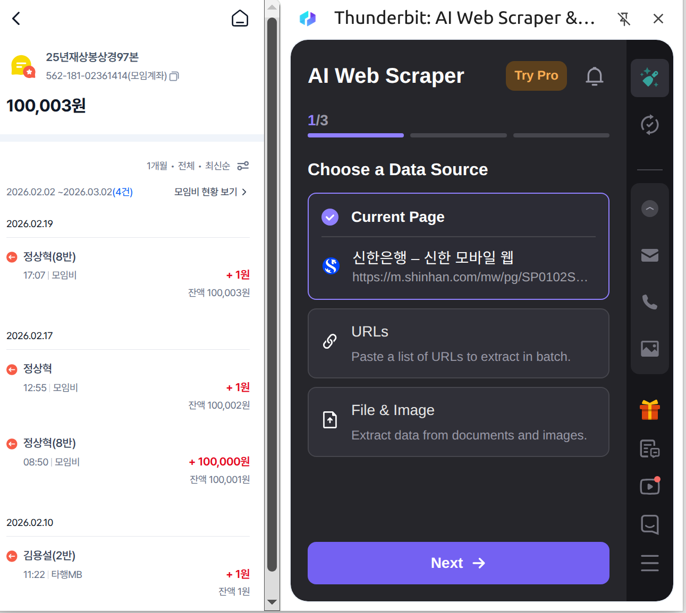
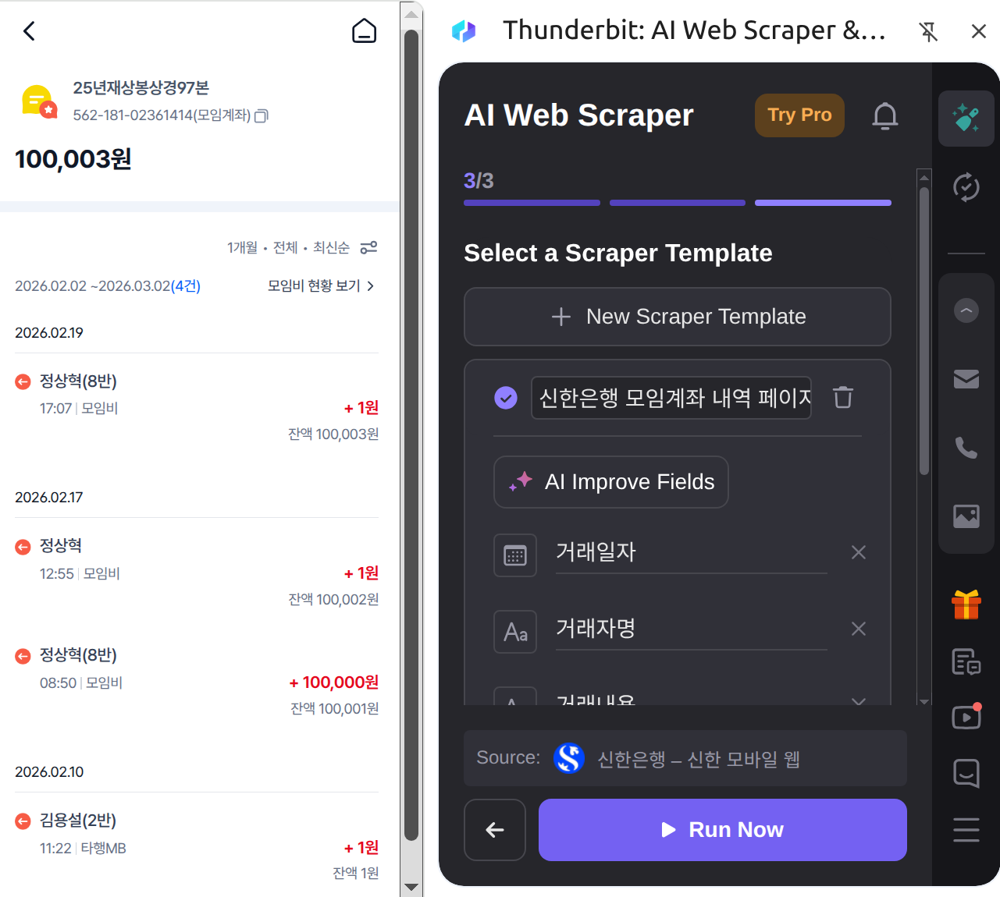
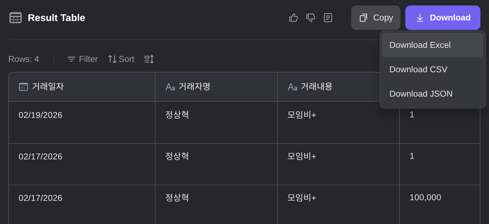

# Thunderbit을 통한 Excel 파일 추출

## 1. Thunderbit 크롬 확장 프로그램 설치

[Thunderbit Chrome Extension](https://chromewebstore.google.com/detail/thunderbit-ai-web-scraper/hbkblmodhbmcakopmmfbaopfckopccgp?utm_source=landing_page&utm_medium=sem)에서 설치합니다.

## 2. 모임통장의 거래내역 페이지 접근

PC에서 신한은행 모바일 페이지로 접근하여 HTML 파일을 저장합니다. (PC 홈페이지에서는 모임원에게는 모임통장 조회 기능이 제공되지 않습니다.)

1. 크롬 브라우저로 https://m.shinhan.com/mw/pg/SP0102S0200F01?mid=270040220100&groupId=493705 으로 접속합니다.
    * 인증은 '신한 인증서'를 클릭하시면 신한은행 모바일앱의 'SOL 패스 인증'등을 통해 하실 수 있습니다.
2. 통장 목록 -> 통장 홈으로 이동합니다.
3. '입출금 ?원'을 클릭하여 입출금내역 페이지로 이동합니다. (조회조건을 설정할 수 있는 페이지입니다.)
4. 원하는 내역이 나오도록 조회 조건을 지정하여 재조회합니다.
5. 크롬의 DevTools 메뉴로 들어갑니다. (단축키 F12)
6. Elements 탭에서 최상단 `<html>` 노드 클릭 → 우클릭 Copy → Copy outerHTML 을 선택합니다.
7. 복사된 내용을 메모장 같은데 붙여넣고 인식이 쉬운 파일명으로, 확장자는 .html으로 저장합니다.

<거래 내역 페이지>

## 3. Thunderbit 실행하여 엑셀파일 다운로드

Thunderbit 크롬확장 프로그램을 실행합니다. 크롬의 우측상단에서 아래 아이콘을 클릭합니다.

이어서 안내에 따라서 진행하면 됩니다.

중간에 Pagenation 관련 설정은 안 하셔도 됩니다.

